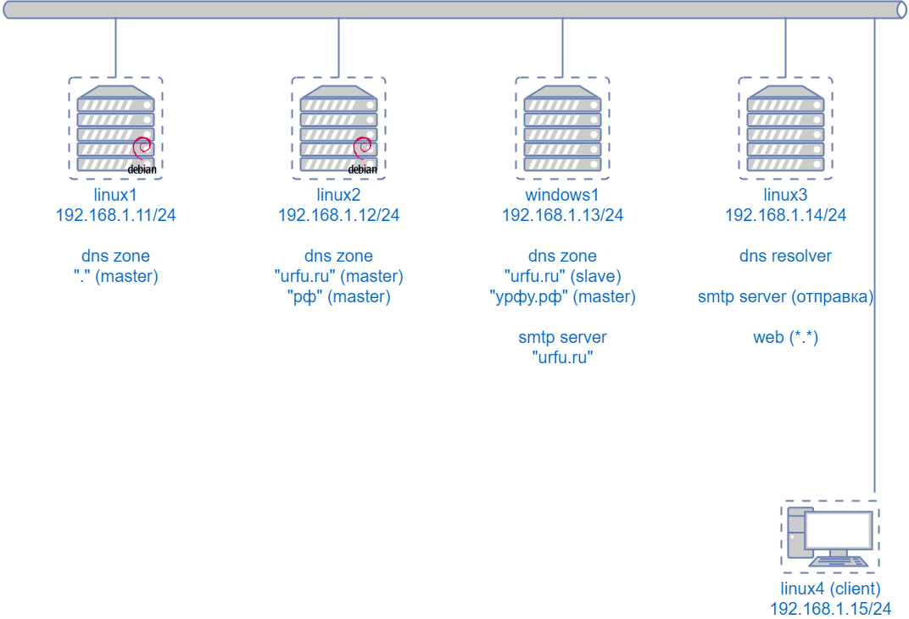

Построение «собственного интернета»
===

Это традиционное упражнение, которое можно отнести к [«ката администрирования»](https://en.wikipedia.org/wiki/Kata_(programming))

Цель - настроить независимую распределенную структуру доменных имён DNS и сервисов



Сценарий
---

* Настройка рабочего места администратора
* Создание зоны (master)
* Создание зоны (slave)
* Создание корневой зоны и делегирование
* Настройка resolv.conf и проверка на внешнем сервере
* Подпись зоны
* Настройка цепочки доверия
* Отправка и получение почты

Настройка рабочего места администратора
---

В файл hosts добавим записи для всех используемых ВМ

На каждом сервере Linux установим службу ssh

Сгенерируем ключ  для авторизации пользователя `ssh-keygen -t ed25519`,
чтобы не вводить пароль ключа при подключении к каждому серверу - `ssh-add`

Скопируем ключ на каждый сервер - `ssh-copy-id linux1` ...

Настройка первой зоны DNS
---

`ssh linux2`, для упрощения работаем с правами суперпользователя `sudo -i`

Установка сервера DNS `apt install bind9 dnsutils`

Просмотр настроек - `cat /etc/bind/named.conf*`, рабочий каталог - `/var/cache/bind`

Рассказываем серверу про новую зону, в файле `/etc/bind/named.conf.local`
```
zone "urfu.ru" {
  type master;
  file "urfu.ru";
};
```

Шаблон файла зоны - `cp /etc/bind/db.empty /var/cache/urfu.ru`
```
$TTL    86400
urfu.ru.        IN      SOA     ns1.urfu.ru. root.localhost. (
                              1         ; Serial
                         604800         ; Refresh
                          86400         ; Retry
                        2419200         ; Expire
                          86400 )       ; Negative Cache TTL

urfu.ru.        IN      NS      ns1.urfu.ru.
ns1.urfu.ru.            A       192.168.1.12

urfu.ru.                A       192.168.1.14
```

Попросить сервер перечитать конфигурацию - `rndc reload`, просмотр состояния и ошибок - `systemctl status bind9`

Переадресация при разрешении имён
---

Подключаемся к серверу-ресолверу **linux3*** - `ssh linux3`, для упрощения работаем с правами суперпользователя `sudo -i`

Разрешим клиентам выполнять рекурсивный поиск (обычное поведение ресолвера),
попросим все незнакомые имена искать сначала на конкретном сервере, в `/etc/bind/named.conf.options` (это *временная настройка*)
```
options{
  ...
  forwarders {
    192.168.1.12; // на этом сервере зона urfu.ru
  };
  ...
  allow-recursion{
      127.0.0.1;
      192.168.1.0/24;
  };
  ...
};
```

Проверяем - `host urfu.ru. 127.0.0.1` должен вернуть правильный IP. Если нет - проверяем работоспособность авторитетного сервера, при необходимости - сбрасываем кеш

Проверяем на ПК-клиенте **linux4** содержимое `/etc/resonv.conf`, там должен быть адрес ресолвера `nameserver 192.168.1.14`

Проверяем разрешение имени из консоли, можно открыть страницу в браузере (если заранее настроен веб-сервер)

Настройка второго сервера зоны (slave)
---

На **linux2** меняем настройки зоны 
```
zone "urfu.ru" {
  ...
  allow-transfer { 192.168.1.13; };
  notify yes;
};
```

В файле зоны добавляем второй сервер имён, увеличиваем serial в SOA, затем `rndc reload`
```
urfu.ru.        IN      NS      ns2.urfu.ru.
ns2.urfu.ru.            A       192.168.1.13
```

На **windows1** добавляем в графическом интерфейсе зону urfu.ru, первичный сервер - linux2

Если второй сервер под управлением BIND, в файле конфигурации описание зоны должно быть примерно таким
```
zone "urfu.ru" {
  type slave;
  file "urfu.ru";
  masters { 192.168.1.12; };
};
```

Настройка корня пространства имён
---

На **linux1** организуем корень пространства имён
```
zone "." {
  type master;
  file "root.db";
};
```

заполняем файл и сразу же организуем делегирование зоны urfu.ru
```
.       IN      SOA     a.root-servers.urfu. root.localhost. (
                              1         ; Serial
                         604800         ; Refresh
                          86400         ; Retry
                        2419200         ; Expire
                          86400 )       ; Negative Cache TTL
.       IN      NS      a.root-servers.urfu.
a.root-servers.urfu.    A       192.168.1.11

urfu.ru.        NS      ns1.urfu.ru.
urfu.ru.        NS      ns2.urfu.ru.
ns1.urfu.ru.    A       192.168.1.12
ns2.urfu.ru.    A       192.168.1.13
```

На всех серверах, которые работают как ресолверы (это **linux3**), меняем подсказки  корневой зоны
```
zone "." {
        type hint;
        //file "/etc/bind/db.root";
        file "root.hint";
};
```

Содержимое `root.hint`
```
.       NS      a.root-servers.urfu.
a.root-servers.urfu.    A       192.168.1.11
```

Возможно, придётся *временно* отключить проверку DNSSEC
```
options {
  ...
  dnssec-validation no;
  ...
}
```

Международные имена
---

Настроим в нашем пространстве имён зону урфу.рф

Преобразуем в совместимое имя `echo урфу.рф | idn`, получаем `xn--p1afbd.xn--p1ai`

Исходя из схемы сети, в корневую зону добавим
```
xn--p1ai.       NS      ns1.urfu.ru.
```

на **linux2** создадим зону `xn--p1ai`
```
xn--p1ai.   SOA ns1.urfu.ru. root.localhost. ( пропущено ) 
xn--p1ai.   NS  ns1.urfu.ru.

xn--p1afbd.xn--p1ai.      NS  ns1.xn--p1afbd.xn--p1ai.
ns1.xn--p1afbd.xn--p1ai.  A   192.168.1.13
```

На **windows1** создадим зону `xn--p1afbd.xn--p1ai`

На **linux4** убедимся, что имя корректно разрешается

Подписываем зоны
---

Рекомендуемое чтение:
https://bind9.readthedocs.io/en/latest/dnssec-guide.html

### Подписываем обычную зону

Внедрим записи DNSSEC в зону urfu.ru (сервер **linux2**)

#### Формирование ключей

Сгенерируем мастер-ключ (KSK)
```
cd /var/cache/bind/
dnssec-keygen -f KSK -n ZONE urfu.ru
```

Сгенерируем ключ для зоны (ZSK)
```
dnssec-keygen -n ZONE urfu.ru
```

Ключи KSK и ZKS можно отличить по значению флагов записи DNSKEY (257 у KSK, 256 у ZSK)

Назначим правильные разрешения на созданные файлы
```
chown -R bind:bind /var/cache/bind/
```

#### Подпись зоны «вручную»

Копируем содержимое ключей в файл зоны
```
cat Kurfu.ru.*key >> urfu.ru
```

меняем serial в записи SOA и подписываем зону командой `dnssec-signzone urfu.ru`

`dnssec-signzone` по умолчанию cчитает, что ключи находятся в текущем каталоге, а имя зоны совпадает с именем файла, при необходимости используйте аргументы -K и -o.

После ручной подписи файла зоны будут созданы два файла - `urfu.ru.signed` и `dsset-urfu.ru.`

Можно проверить, что *все записи в файле зоны подписаны ключом ZSK, а запись DNSKEY подписана ключом KSK*

В описании зоны меняем имя файла
```
zone "urfu.ru" {
  type master;
  file "urfu.ru.signed";
  ...
};
```

#### Проверка правильности подписи

Проверить правильность подписи можно несколькими способами:
`dig +dnssec urfu.ru. soa @127.0.0.1`,
или специализованной командой `delv urfu.ru. soa @127.0.0.1`

Проверка в текущем состоянии покажет, что сервер получает подписанные записи, но им не доверяет

#### Настройка доверия открытому ключу

Скопируем ключ KSK зоны во временный файл `cp Kurfu.ru.{ключ-KSK}.key /tmp/urfu.keys`

Редактируем копию ключа, убираем IN и DNSKEY, добавляем кавычки и точку с запятой

Если используем BIND до версии 9.16, добавляем ключевое слово trusted-keys
```
trusted-keys {
  urfu.ru. 257 3 5 "...";
};
```

Если используем BIND 9.16+, добавляем ключевык слова trusted-keys и static-key
```
trust-anchors {
  urfu.ru. static-key 257 3 5 "...";
};
```

Проверяем подпись зоны, получаем "fully validated"
```
delv -a /tmp/urfu.keys +root=urfu.ru urfu.ru. soa @192.168.1.12
```

### Цепочка доверия

Чтобы ключу KSK зоны urfu.ru доверяли все, отпечаток этого ключа (записи DS) нужно опубликовать в вышестоящей зоне

Записи DS можно взять в файле `dsset-urfu.ru.` после подписи зоны urfu.ru или сформировать командой `dnssec-dsfromkey -f urfu.ru`

Сформировать отпечаток ключа можно программно,
см. пример в статье [«Как вычисляется DS»](https://v13.gr/2012/08/17/dnssec-key-tag-keyid-and-ds-signature-calculation-in-python/)

Можно попытаться вычислить отпечаток «вручную», посчитав хеш от такой строки:
* имя зоны в «в техническом формате» ("\04urfu\02ru\00")
* значение поля флага ("\01\00" для 257)
* значение кода протокола "DNSKEY" ("\03")
* значение кода алгоритма подписи ("\05")
* декодированное из base64 значение открытого ключа
```
echo -en "\04urfu\02ru\00\01\00\03\05" > /tmp/ds_data
echo {данные DNSKEY в BASE64} | base64 -id >> /tmp/ds_data
sha1sum /tmp/ds_data
```

В корневую зону записи можно скопировать или вставить из файла, например, так
```
$INCLUDE "dsset-urfu.ru."
```

### Подписываем корневую зону

Внедрим записи DNSSEC в зону "." (сервер **linux1**)

#### Формирование ключей

Сгенерируем мастер ключ (KSK)
```
cd /var/cache/bind/
dnssec-keygen -f KSK -n ZONE .
```

Сгенерируем ключ для зоны (ZSK)
```
dnssec-keygen -n ZONE .
```

Назначим правильные разрешения на созданные файлы
```
chown -R bind:bind /var/cache/bind/
```

#### Подпись зоны «полуавтоматизированно»

в настройках BIND меняем
```
options {
  ...
  dnssec-enable yes;
  ...
}
```

```
zone "." {
  type master;
  file "root.db";
  auto-dnssec maintain;
  inline-signing yes;
};
```

#### Настройка доверия открытому ключу корневой зоны

скопируем ключ KSK зоны в файл `cp K.{ключ-KSK}.key /etc/bind/my.keys`

Редактируем копию ключа
```
trusted-keys {
  . 257 3 5 "...";
};
```

Распространяем файл `my.keys` на все серверы dns в нашей сети, которые выполняют роль ресолвера

Вносим изменения в конфигурацию BIND
```
options {
  ...
  dnssec-validation yes; // не auto, yes позволяет использовать наши якори доверия
  ...
};
```

в файл `/etc/bind/bind.keys` добавляем новую точку доверия из файла `my.keys`, например, так
```
include "/etc/bind/my.keys";
```

Убеждаемся, что на ресолвере **linux3** команда проверки выдаёт "fully validated"
```
delv urfu.ru soa @127.0.0.1
```

Отправка и получение почты
---

Добавляем в зону urfu.ru запись MX и соответствующую запись A
```
urfu.ru.                MX      10 windows1.urfu.ru.
windows1.urfu.ru.       A       192.168.1.13
```

Добавляем на принимающем сервере SMTP в список локальных доменов urfu.ru

Добавляем на отправляющем сервере SMTP настраиваем диапазон IP-адресов клиентов,
кому разрешено отправлять почту на внешние адреса

Настройки зависят от используемого ПО, напр. в linux используем `dpkg-reconfigure exim4-config`

Тестируем доставку почты с использованием `telnet`, настройка почтового клиента - по желанию

Веб-сервер
---

Для удобства тестирования на сервере **linux3** настраивается веб-сервер `nginx`,
который отвечает на запросы ко всем сайтам строкой "Welcome to {имя сайта}"

Добавляем файл `/etc/nginx/sites-enabled/my-inet`
```
server {
        listen 80 default_server;

        server_name _;

        location / {
                default_type text/html;
                return 200 "Welcome to <b>$host</b>";
                #try_files $uri $uri/ =404;
        }
}
```


Использование vim для редактирования
---

Изучите `vimtutor`
```
gg - в начало файла
w/b - перемещение по словам
dw - удаление слова + пробела
de - удаление слова без пробела
ce - удаление и изменение
```
